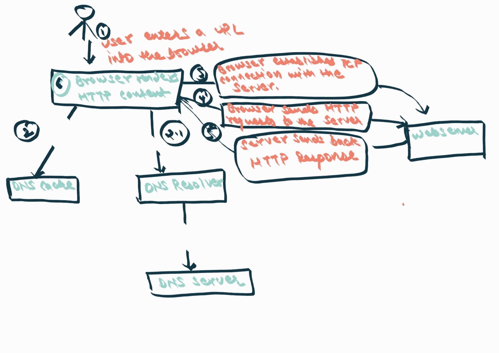

# Assignment 1.1

## Explanation

- The browser goes to the DNS server, and finds the real address of the server that the website lives on .
- The browser sends an HTTP request message to the server, asking it to send a copy of the website to the client. This message, and all other data sent between the client and the server, is sent across your internet connection using TCP/IP.
- If the server approves the client's request, the server sends the client a "200 OK" message, and then starts sending the website's files to the browser as a series of small chunks called data packets (the shop gives you your goods, and you bring them back to your house).
- The browser assembles the small chunks into a complete web page and displays it.
- When browsers send requests to servers for HTML files, those HTML files often contain <link> elements referencing external CSS stylesheets and <script> elements referencing external JavaScript scripts.
- As the browser parses the HTML, it sends requests back to the server for any CSS files it has found from <link> elements, and any JavaScript files it has found from <script> elements, and from those, then parses the CSS and JavaScript.
- The browser generates an in-memory DOM tree from the parsed HTML, generates an in-memory CSSOM structure from the parsed CSS, and compiles and executes the parsed JavaScript.
- As the browser builds the DOM tree and applies the styles from the CSSOM tree and executes the JavaScript, a visual representation of the page is painted to the screen, and the user sees the page content and can begin to interact with it.
